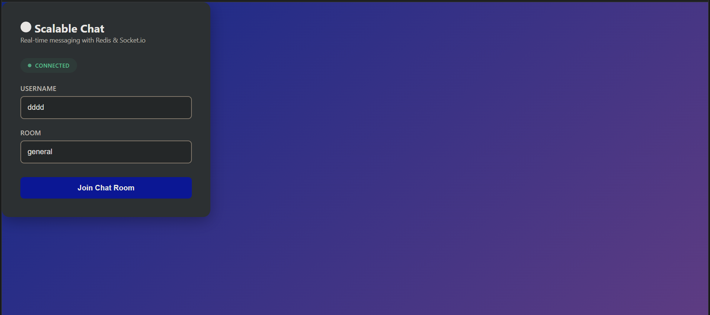

# Scalable Real-Time Chat Application

A cloud-ready, containerized full-stack chat platform designed for performance, reliability, and developer best practices. This project demonstrates modern DevOps workflows and microservices fundamentals, suitable for portfolio presentation and technical interviews.

---

## 🌟 Project Overview

This chat application was created to showcase a robust architecture for real-time web messaging. By integrating Docker, Node.js, React, Socket.io, and Redis, it illustrates how scalable, maintainable, and resilient systems are engineered in production environments.

**Key Objectives**
- Demonstrate container orchestration using Docker Compose for clean development and deployment
- Practice designing distributed systems with stateless frontend and backend microservices
- Implement real-time messaging, pub/sub event handling, and data persistence with Redis
- Create a professional, portfolio-grade project for resume and recruiter review

---

## 🛠 How It Works

- **Frontend:** Users interact via a React SPA, joining chat rooms, sending instant messages, and seeing live member and typing updates.
- **Backend:** Node.js & Express power REST endpoints and Socket.io for messaging, user presence, and chat history.
- **Redis:** Message broker and lightweight store for rooms/members/messages.
- **Docker Compose:** Orchestrates all containers, simulating a production multi-service environment.

**Architecture Highlights**
- Modular services for scalability
- WebSocket-based bidirectional communication
- Redis-powered pub/sub and data storage
- Health checks and restart policies for resilience

---

## 💡 Project Rationale

- **Portfolio-Ready:** Demonstrates DevOps, cloud, and microservices proficiency for hiring managers.
- **Real-World Practices:** Features approaches found in SaaS, social media, and modern collaborative platforms.
- **Technical Breadth:** Tools and patterns used by cloud-first development teams.

---

## 🚀 Installation & Usage

### Quick Start with Docker Compose

**Step 1:**

 Clone the Repository

 
git clone 
```https://github.com/yourusername/real-time-chat-app.git
```cd real-time-chat-app

text

**Step 2:** Build and Launch All Services

```docker-compose up --build

text

**Step 3:** Open the Application  
Visit [http://localhost:3000](http://localhost:3000) in your browser.

**Step 4:** Stop All Services

```docker-compose down

text

---

### Manual Local Development (Advanced)

**Backend**

```cd Backend
```npm install
```npm start

text

**Frontend**
```cd Frontend
```npm install
```npm start

text

Open [http://localhost:3000](http://localhost:3000) in your browser.

*Note: Redis should be running locally, or backend configured to connect to another Redis server.*

---

## 📷 Screenshots




---

## 🚩 What You'll Learn / Demonstrate

- Containerized multi-service orchestration
- Real-time networking (WebSocket/Socket.io)
- Event-driven system design with Redis
- Full-stack development workflow for cloud-native apps

---

## 📬 Contact & Credits

Built by **[Sheersh Sinha]**  
Questions? Connect on [LinkedIn](https://www.linkedin.com/sheershsinha) or email: [sheershsinha30@gmail.com]

---

## 📝 License

MIT

---
